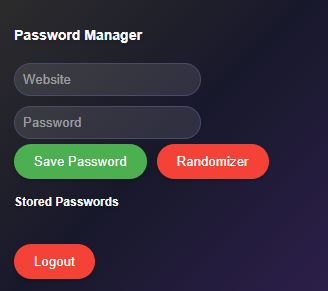

# Secure Password Manager Chrome Extension

⚠️ **Educational Project Notice**: This is an educational project created for learning purposes. While it implements basic security features, it should not be used as your primary password manager for sensitive accounts. The project demonstrates concepts like encryption, password transformation, and Chrome extension development.

A fun and educational password manager Chrome extension that demonstrates basic encryption and password generation capabilities.



*IMPORTANT* LOGIN DETAILS ARE NEVER SAVED, SO YOU MUST REMEMBER FIRST LOGIN DETAILS (Username/Password)

## How Password Encryption Works
This extension uses a simple but educational encryption approach:
1. When you save a password, it gets transformed using our encryption rules:
   - Letters are reversed 
   - Numbers are shifted 
   - Special characters remain unchanged
2. To get your original password:
   - find the the encrypted password
   - Enter it back into the extension
   - The extension will show you the original password

Example:
- Original: "Password123"
- Encrypted: "Kzhhdliw678"
- When you need the original, enter "Kzhhdliw678" to get back "Password123"

## Features

- 🎓 Educational encryption implementation
- 🔄 Password transformation algorithm
- 🎲 Random password generator
- 👤 Basic user authentication
- 🌈 Modern, responsive UI
- 🎨 Dark theme with gradient design

## Important Note

This is a learning project that demonstrates:
- Basic encryption concepts
- Chrome extension development
- UI/UX design
- JavaScript programming
- Secure storage concepts

**Do not use this for highly sensitive passwords!** This is meant for educational purposes and fun experimentation.

## Installation

1. Clone this repository:
```bash
git clone https://github.com/PECADRO/password-manager.git
```

2. Open Chrome and navigate to `chrome://extensions/`

3. Enable "Developer mode" in the top right corner

4. Click "Load unpacked" and select the extension directory

## Usage

1. **First Time Setup**
   - Click "Register" to create a new account
   - Choose any password (min 8 characters)
   - Login with your credentials

2. **Storing Passwords**
   - Enter the website name
   - Enter password or use "Randomizer" for a secure random password
   - Click "Save Password"

**Important**: The saved password is encrypted and can be decrypted by the extension. Whenever you need the real passwords, you can retrieve it by entering any website name and pasting the encrypted password. It will show you the original password.

3. **Retrieving Original Passwords**
   - Enter the website name
   - Paste the encrypted password you saved
   - Click "Show" to see your original password

4. **Managing Passwords**
   - View all stored passwords
   - Show/Hide functionality
   - Delete unwanted entries
   - Logout when done

## Development

The extension is built using:
- HTML/CSS for the UI
- Vanilla JavaScript for functionality
- Chrome Extension APIs
- Basic encryption concepts

### Project Structure
```
password-manager/
├── manifest.json        # Extension configuration
├── popup.html          # Main UI
├── popup.js            # UI logic
├── crypto.js           # Encryption logic
├── icon48.png          # Extension icon
└── README.md          # Documentation
```

## Learning Opportunities

This project helps you understand:
- Basic encryption concepts
- Chrome extension development
- JavaScript programming
- UI/UX design
- Secure storage basics
- Password management concepts

## Contributing

Feel free to experiment and modify! This is a learning project, so:
1. Fork the repository
2. Try different encryption methods
3. Add new features
4. Improve the UI
5. Share your learnings!

## License

This project is licensed under the MIT License - see the [LICENSE](LICENSE) file for details.
This is an educational project - feel free to use, modify, and learn from it! 
